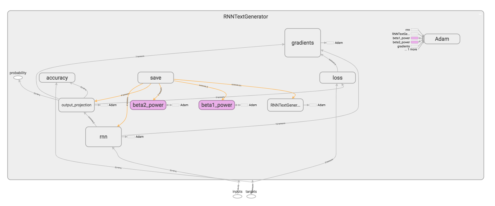

# Introduction
Text generation is a popular problem in Data Science and Machine Learning, and
it is a suitable task for Recurrent Neural Nets.  This report uses tensorflow
to build an RNN text generator and builds a high-level API in Python3. The
report is inspired by @karpathy  (min-char-rnn) and Géron (Hands-On Machine
Learning with Scikit-Learn and TensorFlow). This is a class project in
CST463 - Advanced Machine Learning at Cal State Monterey Bay, instructed by Dr.
Glenn Bruns.

# Modules
`Dataset`, `RNNTextGenerator`, and `ModelSelector` are the three main modules.

## Dataset
Defined in
[src/dataset.py](https://github.com/donaldong/rnn-text-gen/blob/master/src/dataset.py)

Creates a text dataset contains the one-hot encoded text data. It produces
batches of sequences of encoded labels. We split the text data into batches are
used to train the RNN, and we sample a random chuck of the text (with given
length) to evaluate the performance of our data.

### Attributes

#### seq_length
The number of consecutive characters in a slice of the text data (for batching).

#### vocab_size
The number of unique characters in the text data.

### Methods

#### constructor
```
Dataset(
  filenames,
  seq_length,
  shuffle=True
)
```
##### Args
- `filenames`
A list of filenames. They are the paths to one or more plain text files. The
file contents are concatenated in the given order.
- `seq_length`
The number of encoded labels in a sequence. It's the one-hot encoded output of
a slice of consecutive characters in the text.
- `shuffle`
Whether to shuffle the sequences. Default to `True`. When it is set to `False`,
it will batch the sequences in order of the original text.

#### encode
```
encode(text)
```
One-hot encode the text.
##### Args
- `text`
The original character sequence.
##### Returns
The one-hot encoded character sequence.
##### Example
```python
dataset = Dataset([filename], seq_length)
encoded = dataset.encode(text)
assert len(encoded) == len(text)
for label in encoded:
    assert sum(label) == 1
    assert len(label) == dataset.vocab_size
```

#### decode
Decode the one-hot encoded sequence to text format.
```
decode(seq)
```
##### Args
- `seq`
The one-hot encoded character sequence.
##### Returns
The original character sequence.
##### Example
```python
dataset = Dataset([filename], seq_length)
assert dataset.decode(dataset.encode(text)) == text
```

#### batch
```
batch(
    batch_size,
    drop_remainder=True
)
```
Produce many `batch`es. A `batch` has many input and target sequences (`inputs`
and `targets`). Each input and target sequence is a list of encoded labels,
and they offset by 1 timestep, thus they have the same length. With a
sequence `[l0, l0, l1, l1, l2]`, the input sequence would be `[l0, l0,
l1, l1]`, and the target sequence would be `[l0, l1, l1, l2]`.
##### Args
- `batch_size`
The number of instances (sequences) in a single batch.
- `drop_remainder`
Whether the last batch should be dropped in the case of having fewer than
`batch_size` elements.
##### Returns
A number of batches which covers the text data.
##### Example
```python
dataset = Dataset([filename], seq_length)
for batch in dataset.batch(batch_size):
    # The number of elements in the batch is `batch_size`
    assert len(batch.inputs) == batch_size
    assert len(batch.targets) == batch_size
    for i in range(batch_size):
        # Each element in the batch is a sequence
        assert len(batch.inputs[i]) == seq_length
        assert len(batch.targets[i]) == seq_length
        for j in range(seq_length):
            # One-hot encoded
            assert sum(batch.inputs[i][j]) == 1
            assert len(batch.inputs[i][j]) == dataset.vocab_size
```

#### sample
```
sample(batch_size)
```
Radomly select some sequences (with replacement).
##### Args
- `batch_size`
The number of instances (sequences) in a single batch.
##### Returns
A single batch.
##### Example
```python
dataset = Dataset([filename], seq_length)
count = 0
batch = dataset.sample(batch_size)
for seq in batch.inputs:
    assert len(seq) == seq_length
    for i in range(seq_length):
        # One-hot encoded
        assert sum(seq[i]) == 1
        assert len(seq[i]) == dataset.vocab_size
    count += 1
assert count == batch_size
```

## RNNTextGenerator
Defined in
[src/text_generator.py](https://github.com/donaldong/rnn-text-gen/blob/master/src/text_generator.py)

Creates a recurrent neural network with a tensorflow RNNCell cell (which
performs dynamic unrolling of the `inputs`). It has an output projection
layer which produces the final probability for each character class. It
generates the text by sampling the next character based on the probability
distribution of the last character of the current sequence.

### Attributes

#### params
The parameters which define the text generator.

### Methods

#### constructor
```
RNNTextGenerator(
  seq_length,
  vocab_size,
  rnn_cell=tf.nn.rnn_cell.BasicRNNCell,
  n_neurons=100,
  activation=tf.tanh,
  optimizer=tf.train.AdamOptimizer,
  learning_rate=0.001,
  epoch=5,
  batch_size=25,
  name='RNNTextGenerator',
  logdir=None
)
```
Initialize the text generator and contruct the TensorFlow graph.

##### Args
- `seq_length`
The number of encoded labels in a sequence.
- `vocab_size`
The number of unique characters in the text data.
- `rnn_cell`
An RNN cell from `tf.nn.rnn_cell`. The cell has `n_neurons` neurons, takes the
`activation` funtions, and goes into `tf.nn.dynamic_rnn`.
- `n_neurons`
The number of neurons in the RNN cell.
- `activation`
The activation function (callable) for the RNN cell.
- `optimizer`
A subclass of `tf.train.Optimizer`. The optimizer to use for minizing the loss.
- `learning_rate`
A Tensor or a floating point value. The learning rate of the `optimizer`.
- `epoch`
The number of times to iterate through the dataset.
- `batch_size`
The number of instances (sequences) in a single batch.
- `name`
The name of the text generator. It is used for graph visualization in
tensorboard (variable scope), and saving/restoring the model (checkpoint name).
- `logdir`
The path to the tensorflow summary

##### TensorBoard screenshot


#### fit
```
fit(dataset, save_scores=False)
```
Feed the dataset `epoch` times, with batches of `batch_size` sequences.

##### Args
- `dataset`
A `Dataset` object which creates batches to train the model.
- `save_scores`
Whether to store the training accuracy and loss.
##### Returns
If `save_scores` is `True`, it returns a `pd.DataFrame` which stores the
training accuracy and loss.

##### Example
```python
dataset = Dataset([filename], seq_length)
model = RNNTextGenerator(
    seq_length,
    dataset.vocab_size,
    learning_rate=learning_rate,
    epoch=epoch,
    batch_size=batch_size,
)
scores = model.fit(dataset, save_scores=True)
```

#### score
```
score(dataset, batch_size=None, n_samples=5)
```
Measure the score of the text generator. The score is the average result of
`n_samples` times sampling from the dataset. It tests how the model will
perform on sequences it has not *completely* seen yet.

##### Args
- `dataset`
A `Dataset` object to sample from. A sample is a single `Batch`.
- `batch_size`
The number of instances (sequences) in a single batch. When `batch_size` is
`None`, it uses the `batch_size` for training the model.
- `n_samples`
The number of times to sample from the dataset for testing.

##### Returns
The average accuracy and loss of the `n_samples` samples.

#### predict
```
predict(inputs)
```
Predict the probabilities of the next labels in each input sequence.

##### Args
- `inputs`
The input sequences (with one-hot encoded labels).

##### Returns
The target sequences (with the probabilities of each label). The shape of the
target sequences would be `[len(inputs), seq_length, vocab_size]`.


#### save
```
save(path='./model')
```
Save the model in the specified path. The files use the `name` of the text
generator.

##### Args
- `path`
The path to store the model.

#### restore
```
restore(path='./model')
```
Restore the model in the specified path. It assumes the files use the `name` of
the text generator exists, or it throws exceptions.

##### Args
- `path`
The path where the model is stored.

#### sample
```
sample(self, dataset, start_seq, length)
```
Sample from the text generator based on the predicted probability distribution
for the next label. For example, assume the target for the input sequence
`[l1, l1, l2]` is `[[l1: 90%, l2: 10%], [l1: 10%, l2: 90%], [l1: 10%, l2: 90%]]`,
the next character is sampled from `[l1: 10%, l2: 90%]`. Thus the next
character would be `l2 ` with a probability of `0.9`, or `l1` with a
probability of `0.1`.

##### Args
- `dataset`
A `Dataset` object to encode and decode the labels. This method is sampling
from the text generator, not from the dataset.
- `start_seq`
The character sequence to begin with.
- `length`
The length of the generated text.

##### Returns
The sampled text with `length` characters.

#### generate
```
generate(dataset, start_seq, length)
```
Generate the text from the text generator using the given `start_seq`. This
method wraps the `sample`. It creates a new model with the new sequence length
and restores the previous weights.

##### Args
- `dataset`
A `Dataset` object to encode and decode the labels. This method is sampling
from the text generator, not from the dataset.
- `start_seq`
The character sequence to begin with.
- `length`
The length of the generated text.

##### Returns
The generated text with `length` characters.

##### Example
```python
model.fit(dataset)
print(start_seq + model.generate(
    dataset,
    start_seq,
    50
))
```

## ModelSelector
Defined in
[src/model_selector.py](https://github.com/donaldong/rnn-text-gen/blob/master/src/model_selector.py)

Performs randomized search and rank the models by accuracy. It selects the best
ranking models and allows lengthy searching (for hours/days).

### Methods

#### constructor
```
ModelSelector(
  dataset,
  params,
  n_samples=5,
):
```
##### Args
- `dataset`
A `Dataset` object to train the model.
- `params`
A dictionary which describes the search space.  The each key of the dictionary
stores a list of parameters. The selector randomly choice a parameter value
from the list, for each parameter key.
- `n_samples`
The number of times to sample from the dataset for testing. The selector uses
the average accuracy to rank the models.

#### search
```
search()
```
Search the parameter space. It generates a combination of parameters, fit, and
score the text generator. The selector keeps track of the model and its average
accuracy and score on the test data.

##### Returns
A fitted `RNNTextGenerator`.

##### Example
```
params = {
    'learning_rate': np.linspace(0, 1, 10000, endpoint=False),
    'epoch': np.arange(1, 6),
    'batch_size': np.arange(25, 100),
}
selector = ModelSelector(dataset, params)
for _ in range(n):
  selector.search()
```
It will randomly select a `learning_rate`, `epoch`, and `batch_size` for the
`RNNTextGenerator`, and fit it `n` times.

#### as_df
```
as_df()
```
Save the searching result (models and their scores) as a pandas data frame.
```
                                               model  accuracy        loss
0  {'vocab_size': 70, 'rnn_cell': <class 'tensorf...  0.094519   88.173103
1  {'vocab_size': 70, 'rnn_cell': <class 'tensorf...  0.068282  104.829025
2  {'vocab_size': 70, 'rnn_cell': <class 'tensorf...  0.052424   12.201582
```

##### Returns
A `pd.DataFrame` sorted by `accuracy` in non-increasing order.

#### best_models
```
best_models(n)
```
Get the top `n` models ordered by their accuracies.

##### Args
- `n`
The numer of best models.

##### Returns
A list of `RNNTextGenerator` with length `n`.

#### best_model
```
best_model()
```
Get the model with the highest accuracy. It wraps the `best_models` method.

##### Returns
An `RNNTextGenerator` with the highest accuracy among the models the selector
has seen so far.
